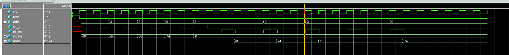
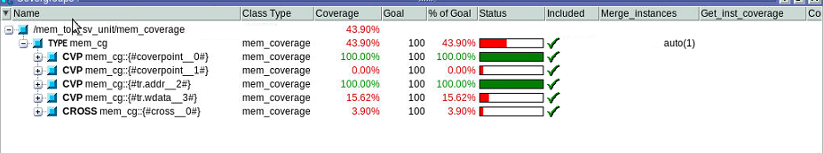

# RAM-Verification
Verification of RAM using UVM TB - Covered advanced topics like assertion and function coverage
__________________________________________________________________________
Coverage file were added TB with Makefile --> v1.1

simulation               -> make RUN WR=<write_count_number> RE=<read_count_number>
basic test               -> make BASE_TEST
simulation with coverage -> make RUN_COV WR=<write_count_number> RE=<read_count_number>
__________________________________________________________________________

New file were added in RTL and TB with Makefile --> v1.0

simulation               -> make RUN WR=<write_count_number> RE=<read_count_number>
__________________________________________________________________________

## Memory Waveform :- 

__________________________________________________________________________

##Coverage :- 

